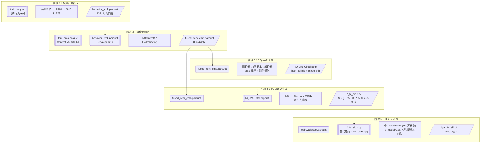

# 方案 A：TA-SID（Transition-aware Semantic ID）方案总结

> Concat + LayerNorm 融合 Behavior Embedding — 基线方案，已完成全部三数据集验证

---

## 一、核心思想

**原始 TIGER 的问题：** Semantic ID 仅基于 Content Embedding（Sentence-T5），编码的是物品的**文本语义**，完全不了解用户的**行为模式**。

**TA-SID 的改进：** 将 Content Embedding 与 Behavior Embedding（从用户行为序列提取）分别 LayerNorm 后拼接，在融合空间上重新训练 RQ-VAE，生成携带"行为语义"的新离散码。

```
原始 TIGER:  Content Emb → RQ-VAE → 纯语义码 → T5
TA-SID:      Content Emb + Behavior Emb → Concat → RQ-VAE → 融合码 → T5
```

---

## 二、完整 Pipeline（5 个步骤）

### 数据流转总览



| 阶段 | 原来 | TA-SID | **本质变化** |
|:----|:----|:-------|:-----------|
| **1** | ❌ 无 | ✅ 新增 | 从行为序列提取共现，无随机性 |
| **2** | ❌ 无 | ✅ 新增 | LN + Concat 融合，无随机性 |
| **3** | 训 Content (768d) | 训**融合嵌入** (896/4224d) | **输入变了，模型结构没变** |
| **4** | 生成 `*_t5_rqvae.npy` | 生成 **`*_ta_sid.npy`** | **码的来源变了，格式一样** |
| **5** | TIGER + 原始码 | **TIGER + TA-SID 码** | **只换 `--code_path`，模型不改** |

### Step 1：构建 Transition Graph → Behavior Embedding

**输入：** 用户行为序列（`train.parquet`，每条记录为 `[历史物品列表, 目标物品]`）

**输出：** `behavior_emb.parquet`（128 维行为嵌入，PPMI+SVD）

**流程：**

```python
用户序列 → 共现矩阵 C (N×N) → PPMI 变换 → Truncated SVD (k=128) → behavior_emb
```

#### 1a. 构建共现矩阵 C

- `window_size=3`：每个物品看左右各 1 个邻居（自身不算）
- `C[i][j]` = 物品 i 和 j 一起出现在同一个窗口内的次数
- 矩阵为对称矩阵，用 `scipy.sparse.csr_matrix` 存储（稀疏，仅存非零元素）

**代码关键逻辑：**
```python
# 计数阶段：只存 (小, 大) 一个方向
a, b = (center, seq[j]) if center < seq[j] else (seq[j], center)
coo[(a, b)] += 1

# 展开阶段：镜像到两个方向，保证行和与列和正确
for (a, b), cnt in coo.items():
    rows += [a, b]; cols += [b, a]; data += [cnt, cnt]  # 镜像
```

> **为什么要镜像？** CSR 矩阵的 `sum(axis=1)` 只对存储的元素计数。不镜像会导致 `row_sum ≠ col_sum`，PPMI 公式计算错误。镜像本身不影响数值结果——分子分母同时翻倍，抵消。

#### 1b. PPMI 变换

```python
PPMI[i][j] = max(log(C[i][j] × sum_all / (row_sum[i] × col_sum[j])), 0)
```

**含义：**
- 分子：**实际共现次数** × 总次数
- 分母：**随机期望**（两个物品各自出现的总次数相乘）
- 比值 > 1 → PMI > 0 → **这两个物品真的经常一起出现**
- 比值 < 1 → PMI < 0 → 剪掉（置 0）

**噪声处理：**
- `min_cooccur=1`：共现仅 1 次也进入计算
- **但 SVD 截断自动去噪**：Truncated SVD 仅保留 top-k 个奇异值，偶发共现（仅 1 个用户的行为模式）对应小奇异值 → 被截断丢弃；被大量用户验证过的共现模式（大奇异值）→ 保留
- 两阶段防线：PPMI 剔除负相关，SVD 截断剔除低置信度噪声

#### 1c. Truncated SVD 降维

```python
U, S, Vt = svds(PPMI, k=128)
behavior_emb = U * sqrt(S)  # (N, 128)
```

- 从 PPMI 矩阵取 top-128 个最大奇异值对应的成分
- `U × sqrt(S)`：按奇异值加权，最重要的行为模式在前几维，噪声在尾部截断
- 冷启动物品（无行为记录）：embedding 置零

---

### Step 2：双模态融合（LayerNorm + Concat）

**输入：**
- Content Embedding（768d 或 4096d，Sentence-T5）
- Behavior Embedding（128d，PPMI+SVD）

**输出：** `fused_item_emb.parquet`（融合嵌入，896d 或 4224d）

**为什么需要 LayerNorm：**

| 统计量 | Content（4096d） | Behavior（128d） | 比值 |
|:-------|:--------------:|:--------------:|:----:|
| 行范数均值 | **9.31** | **0.68** | **13.7×** |
| 行范数中位数 | **6.88** | **0.55** | **12.5×** |
| 元素标准差 | **0.188** | **0.076** | **2.5×** |

如果不做 LayerNorm，直接 Concat，**Behavior 信号在数值上只有 Content 的 1/10**，RQ-VAE 几乎不会学到它。

**LayerNorm 的效果：**

```python
LayerNorm(x) = (x - μ) / σ   # 每个样本自己做 z-score 标准化
```

对 Content 和 Behavior **分别独立**做 LayerNorm：

```
原始 Content[:10]  = [-0.047,  0.261, -0.320, -1.633, ...]   ← σ=0.19
LN(Content)[:10]  = [-0.200,  1.074, -1.330, -6.760, ...]   ← σ=1.00

原始 Behavior[:10] = [ 0.018, -0.031,  0.005, -0.005, ...]   ← σ=0.08
LN(Behavior)[:10] = [ 0.614, -1.086,  0.155, -0.185, ...]   ← σ=0.99
```

两个模态的 σ 都变成 ≈1，RQ-VAE 能**公平"听见"两个信号**。

**Concat：**
```python
fused = torch.cat([LN(Content), LN(Behavior)], dim=-1)  # (N, 768+128=896)
```

---

### Step 3：RQ-VAE 重训练

**输入：** 融合嵌入（896d 或 4224d）

**参数（与基线一致）：**

| 参数 | 值 | 说明 |
|:----|:--:|:-----|
| 隐层 | [512, 256, 128, 64] | 输入维度变了但第一层自动适配 |
| codebook | 3 × 256 | 3 层残差量化，每层 256 个码 |
| e_dim | 32 | 每个码的维度 |
| epochs | 3000 | |
| eval_step | 50 | 每 50 epoch 评估一次碰撞率 |
| save_limit | 5 | 仅保留碰撞率最低的 5 个 epoch 文件 |

**输出：** `rqvae/ckpt/{ds}_TA_SID/{timestamp}/best_collision_model.pth`

**关键：** `find_best_checkpoint()` 函数（P0 修复后）从所有训练轮次子目录中选取碰撞率最低的 checkpoint 用于后续代码生成，而非按文件修改时间选最新。

---

### Step 4：TA-SID 代码生成

**输入：** RQ-VAE checkpoint + 融合嵌入

**流程：**
1. 加载最优 checkpoint
2. 对每个物品的融合嵌入做 RQ-VAE 编码 → 得到 3 层 × 256 codebook 的离散索引
3. 构造 TA-SID 码：`[<a_123>, <b_45>, <c_67>, <d_89>]`（4 个 token）
4. **Sinkhorn 迭代去碰撞**：重复最多 30 轮，对碰撞组重新编码（带 Sinkhorn 噪声扰动）→ 碰撞率降至 **≤ 0.36%**
5. 最终代码级去重：末尾附加一维解决排列组合级碰撞
6. 输出 `{ds}_ta_sid.npy`

**Sinkhorn 迭代原理：**
```python
for collision_items in collision_item_groups:
    d = data[collision_items]
    indices = model.get_indices(d, use_sk=True)  # 用 Sinkhorn 重新分配码
    # 碰撞的每个物品拿到不同的码
```

---

### Step 5：T5（TIGER）训练

**输入：** `{ds}_ta_sid.npy` 替换原始 `{ds}_t5_rqvae.npy`

**参数（与基线完全一致）：**

| 参数 | 值 |
|:----|:--:|
| vocab_size | 1025 |
| d_model | 128 |
| num_layers | 4 |
| d_ff | 1024 |
| num_epochs | 200 |
| beam_size | 30 |
| early_stop | 10 |

**唯一变化：** 仅通过 `--code_path` 切换数据源，模型结构零修改。

---

## 三、三数据集结果总表

| 数据集 | Content 维度 | 融合维度 | RQ-VAE 碰撞率 | 代码碰撞率 | 基线 NDCG@20 | TA-SID NDCG@20 | **提升** |
|:------:|:----------:|:--------:|:------------:|:---------:|:-----------:|:-------------:|:--------:|
| Beauty | 768d | 896d | 1.08% | — | 0.0379 | **0.0418** | **+10.3%** 🟢 |
| Sport | 4096d | 4224d | 9.81% | 0.36% | 0.0207 | **0.0276** | **+33.3%** 🟢 |
| Toys | 4096d | 4224d | 7.93% | 0.23% | 0.0305 | **0.0317** | **+3.9%** 🟢 |

**规律：基线越差的数据集，TA-SID 改进幅度越大。**

---

## 四、关键问题解答

### Q1：Content Embedding 维度为何不同？

| 数据集 | 维度 | Sentence-T5 版本 |
|:------|:---:|:----------------|
| Beauty | **768d** | Sentence-T5-base（110M 参数） |
| Sport | **4096d** | Sentence-T5-xl（1.2B 参数） |
| Toys | **4096d** | Sentence-T5-xl（1.2B 参数） |

维度差异是因为数据预处理时间不同，编码模型从 base 版升级到了 xl 版。

### Q2：维度不同是否影响跨数据集对比？

**不影响。** 原因：
- 每个数据集内部**自己跟自己比**（基线 vs TA-SID），content 来源一致
- 跨数据集对比看的是**相对提升百分比**（+33.3%、+10.3%、+3.9%），不是绝对值
- 高维融合嵌入（4224d）→ RQ-VAE 第一层压缩比增大（4224→512 vs 768→512）→ RQ-VAE 级碰撞率偏高，但 Sinkhorn 后均 ≤ 0.36%

### Q3：PPMI 到底在算什么？

```
PMI(i,j) = log( C[i][j] / (row_sum[i] × col_sum[j] / sum_all) )
         = log( 实际共现次数 / 随机碰巧共现的期望次数 )
```

- **实际共现**：从用户序列中数出来的
- **随机期望**：假设物品之间没有关联，它们该共现多少次（正比于各出现频次之积）
- **PPMI = max(PMI, 0)**：只保留正相关，忽略噪声

### Q4：共现矩阵为什么对称并镜像？

- 镜像是为了 `row_sum` 和 `col_sum` 正确（CSR 矩阵求和依赖存储元素）
- 镜像本身不影响 PPMI 值——分子分母同时翻倍，抵消
- 语义上：用户行为共现是双向的，买 A 也买 B ≈ 买 B 也买 A

### Q5：共现 1 次也保留吗？怎么防范噪声？

- `min_cooccur=1`：共现一次也进入计算
- **但真正去噪的是 SVD 截断**：
  - 偶发共现（仅 1 个用户）→ 对应小奇异值 → 被截断丢弃
  - 大量用户验证过的模式 → 对应大奇异值 → 保留
- 这是两阶段设计：PPMI 负责剔除负相关，SVD 负责剔除低置信度

### Q6：RQ-VAE 高碰撞率是否意味着码本利用率低？

**不是。** 码本容量是 256³ ≈ 1677 万，18k 物品只占 0.1%。碰撞率高是因为高维输入（4224d）→ 第一层强制压缩（4224→512）→ 信息丢失多 → 量化更难。但 Sinkhorn 能完美解决（0.36%）。

---

## 五、已知 Bug 与修复记录

### P0：按 mtime 选 checkpoint → 按碰撞率最优（已修复）

- **影响：** Sport 使用了碰撞率 10.52% 的 checkpoint（第 3 轮），而第 1 轮有 9.81% 的更优结果
- **修复：** `find_best_checkpoint()` 函数遍历所有子目录，正则提取 `_collision_([0-9.]+)_`，取全局最低
- **效果：** NDCG@20 提升从 +27.5% → **+33.3%**

### P1：日志覆盖（已修复）

- `tee` → `tee -a`，各轮次日志顺序累积

### P2：硬编码路径（已修复）

- `/data/gtx/...` → `"$(dirname "$0")/.."`

### P3：未使用的参数（已修复）

- 移除 `--ckpt_dir` 参数

---

## 六、项目文件清单

| 文件 | 职责 |
|:----|:-----|
| `rqvae/build_transition_graph.py` | Step 1：PPMI+SVD → Behavior Embedding |
| `rqvae/fuse_embeddings.py` | Step 2：LayerNorm + Concat 融合 |
| `rqvae/main.py` | Step 3：RQ-VAE 训练（未修改） |
| `rqvae/trainer.py` | RQ-VAE 训练器（未修改） |
| `rqvae/generate_code.py` | Step 4：代码生成（模板化） |
| `model/main.py` | Step 5：T5 训练（未修改） |
| `rqvae/run_ta_sid_pipeline.py` | 全自动流水线（Step 3→4→5） |
| `rqvae/run_ta_sid_step45.py` | 断点续跑（Step 4+5） |
| `rqvae/run_both_datasets.sh` | 批处理启动脚本 |

---

> **文档创建：** 2026-07-17
> **状态：** ✅ 方案 A 三数据集验证完成
> **下一步：** 与方案 B~E 对比后决定推进方向
